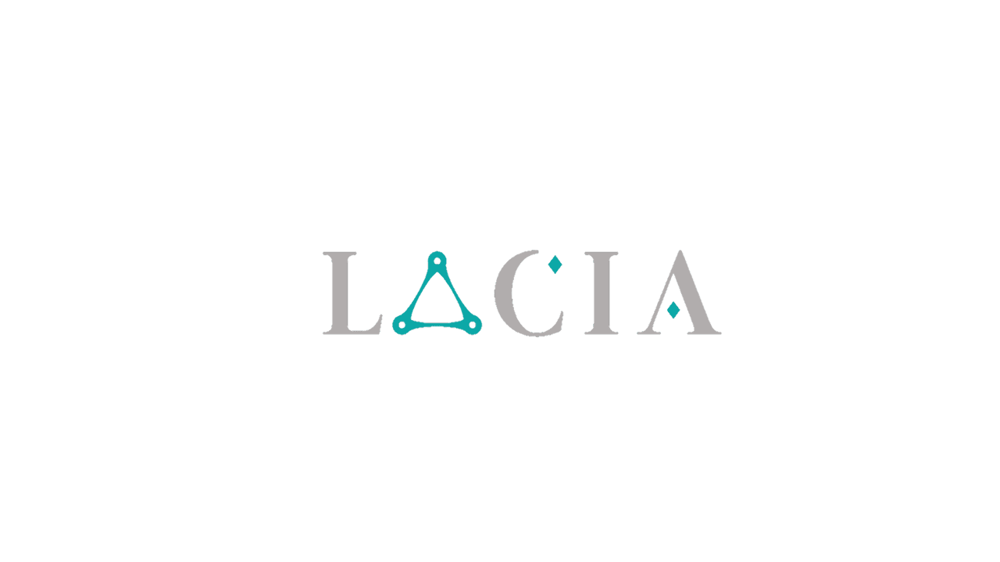

Project Lacia is a C++26 forward-thinking general-purpose engine designed to redefine modern software engineering.

It offers to the developers an unparalleled flexibility, security, performance, and maintainability:

- Security & Reliability: With built-in robust memory safety mechanisms, such as the incorporation of unsafe/safe blocks and the borrow checker, it ensures unparalleled reliability for mission-critical applications.

- Futuristic Design: Lacia embraces a sleek, modular architecture with an intuitive, expressive API that ensures efficiency without sacrificing power.

- Next-Generation Performance: Optimized with zero-cost abstractions, enhanced parallelism, and AI-assisted optimizations, delivering unprecedented execution speed.

- Universal Compatibility: Designed for multi-platform deployment, whether on embedded systems, cloud environments, or high-performance computing clusters.

- Intelligent Automation: Packed with smart template metaprogramming, automated code analysis, and adaptive runtime behavior, reducing boilerplate and accelerating development cycles.

Project Lacia is a movement towards the future of programming, empowering developers to build groundbreaking applications with unprecedented ease.

## Requirements

Project Lacia assumes a LP64 or LLP64 data model.

- Latest LLVM stable toolchain installed and added to PATH
- CMake 4

### For macOS

- MacOSX 15.5
- Xcode 16.3

## Documentation

You can find the documentation under the ``Documentation`` folder. A mardown renderer such as Obsidian is recommended.